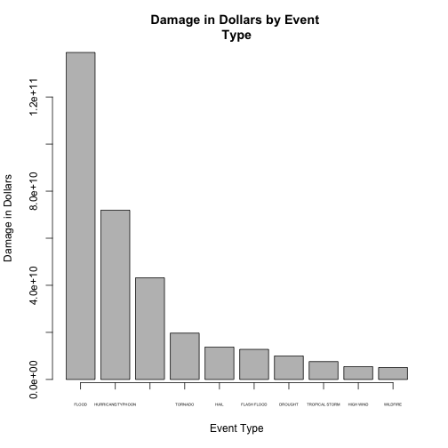
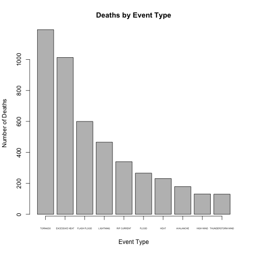

# Economic and Population Hardship Related to Severe Weather in the United 
States


## Synopsis


The goal of this analysis is to take a look at extreme weather conditions that 
exist in the United States to discern which types of Events are most harmful 
economically and to the health of the population. I quantified harm to the 
population in fatalities and economic hardship by the sum of crop and property 
damage. In this analysis, I only looked at extreme weather events since the 
start of 2000, as those event had the best catalogued instances. What I found 
is that the most destructive events, in descending order, are as follows:

Destructive in terms of Economic impact:

1. Flood
2. Hurricane/Typhoon
3. Storm Surge
4. Tornado
5. Hail

Destructive in terms of loss of life:
1. Tornado
2. Execessive Heat
3. Flash Flood
4. Lightning
5. Rip Current


## Data Processing


The following code will set the appropriate working directory and load all of
the necessary packages (if applicable):


```r
setwd("~/Repository/Coursera/RepResearch_Assign2")
```

===============================================================================

PLEASE NOTE: In my original analysis, I used the following code block to 
download the file from the Internet:

url <- "https://d396qusza40orc.cloudfront.net/
repdata%2Fdata%2FStormData.csv.bz2"
destfile <- "Storm_Data.csv.bz2"
download.file(url=url, destfile=destfile, method="curl")

For some reason which I cannot surmise, when I tried running the code again, 
it does not download the entire file. Instead, it stops after only a second or 
2 and gives no error message. As a result, I am removing this code from my Doc 
and will walk through how to perform this process manually.

===============================================================================

The following will be the manual process to download the data file from the 
internet and create a CSV document in the Working Directory:

1. Paste the following URL into the URL bar (without quotes): "https://
d396qusza40orc.cloudfront.net/repdata%2Fdata%2FStormData.csv.bz2"
2. Rename the file (without quotes): "Storm_Data.csv.bz2"
3. Move the file to the Working Directory (in my case, "~Repository/Coursera/
RepResearch_Assign2")

Now we will create an R Object from the CSV and only take the columns we will
use in our analysis:


```r
data <- read.csv(bzfile("Storm_Data.csv.bz2"))
data <- data[,c("BGN_DATE","STATE","EVTYPE","FATALITIES","INJURIES","PROPDMG",
"PROPDMGEXP","CROPDMG","CROPDMGEXP")]
```

In order to get the best possible analysis, we will only look at the data 
starting at the year 2000, the following code accomplishes this:


```r
data$BGN_DATE <- as.Date(data$BGN_DATE, format="%m/%d/%Y")
data$Event_Year <- as.numeric(format(data$BGN_DATE, "%Y"))
data <- data[data$Event_Year >= 2000, ]
```

To calculate the precise Property and Crop Damage, we will multiply both the 
Crop Damage and the Property Damage columns by their multipliers:


```r
data$PROPDMGEXP <- as.character(data$PROPDMGEXP)
data$PROPDMGEXP[tolower(data$PROPDMGEXP) == "b"] <- 1000000000
data$PROPDMGEXP[tolower(data$PROPDMGEXP) == "m"] <- 1000000
data$PROPDMGEXP[tolower(data$PROPDMGEXP) == "k"] <- 1000
data$PROPDMGEXP[tolower(data$PROPDMGEXP) == "h"] <- 100
data$PROPDMGEXP[data$PROPDMGEXP == ""] <- 1
data$PROPDMGEXP[data$PROPDMGEXP == "0"] <- 1

data$CROPDMGEXP <- as.character(data$CROPDMGEXP)
data$CROPDMGEXP[tolower(data$CROPDMGEXP) == "b"] <- 1000000000
data$CROPDMGEXP[tolower(data$CROPDMGEXP) == "m"] <- 1000000
data$CROPDMGEXP[tolower(data$CROPDMGEXP) == "k"] <- 1000
data$CROPDMGEXP[tolower(data$CROPDMGEXP) == "h"] <- 100
data$CROPDMGEXP[data$CROPDMGEXP == ""] <- 1
data$CROPDMGEXP[data$CROPDMGEXP == "0"] <- 1

data$Crop_Damage <- data$CROPDMG * as.numeric(data$CROPDMGEXP)
data$Prop_Damage <- data$PROPDMG * as.numeric(data$PROPDMGEXP)
data$Econ_Damage <- data$Prop_Damage + data$Crop_Damage
```


## Results


Now I will display the figure which shows the Events by greatest Economic 
consequences:


```r
econData <- aggregate(formula=Econ_Damage~EVTYPE, data=data, FUN=sum)
econData <- econData[with(econData, order(Econ_Damage, decreasing=TRUE)), ]
econData <- econData[1:10, ]

mp <- barplot(econData$Econ_Damage, axes=F, main="Damage in Dollars by Event 
Type")
axis(1, at=mp, labels=econData$EVTYPE, cex.axis=0.35)
axis(2, ylim=range(0, econData$Econ_Damage))
title(xlab="Event Type")
title(ylab="Damage in Dollars")
```

 

Now I will display the figure which shoes the Events by greatest impact to 
population health:


```r
popData <- aggregate(formula=FATALITIES~EVTYPE, data=data, FUN=sum)
popData <- popData[with(popData, order(FATALITIES, decreasing=TRUE)), ]
popData <- popData[1:10, ]

mp <- barplot(popData$FATALITIES, axes=F, main="Deaths by Event Type")
axis(1, at=mp, labels=popData$EVTYPE, cex.axis=0.35)
axis(2, ylim=range(0, popData$FATALITIES))
title(xlab="Event Type")
title(ylab="Number of Deaths")
```

 


